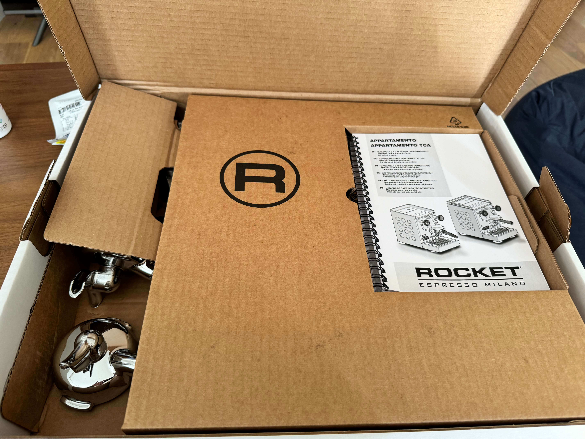

+++
title = "エスプレッソマシン(ROCKET APPARTAMENTO TCA)を個人輸入した"
date = 2024-01-20T15:00:00+09:00
Author = "reizist"
keywords = ["個人輸入", "ROCKET", "APPARTAMENTO", "エスプレッソマシン", "espresso machine", "エスプレッソ", "espresso", "コーヒー", "coffee"]
Cover = "https://blog.reizist.com/post/bought-espresso-machine/cover.jpg"
summary = "エスプレッソマシン ROCKET APPARTAMENTO TCAを個人輸入しました。"
tags = ["life", "gadget"]
toc = true
draft = false
+++

[エスプレッソマシン事始め](https://blog.reizist.com/post/espresso-machine/) に書いた通り、エスプレッソマシンの購入を検討していたが実際に購入し使い始めたので経緯・詳細を書く。

<!--more-->

## 選んだ機種
結論から言うと、[ROCKET APPARTAMENTO TCA](https://rocket-espresso.com/products/domestic-models/appartamento-tca)を[ESPRESSO COFFEE SHOP](https://www.espressocoffeeshop.com/ja/)で買った。

前の記事を書いた時点では

> 家庭用でグラインダーを一旦考慮しないことにして抽出機のみで検討すると、 最低6万〜が購入ラインになりそうだがそれでも許容できない不満がいくつかあり

> ただし抽出機に20万出せるかというとそこまでのモチベーションは無いというか、それだったら5万のグラインダーと10万の抽出機にしたかったりする

> 妥協点としては流石にマルチボイラーは諦める

> 流石にスチームと抽出は一体であってほしい

などの悩みを抱えていたが、調べれば調べるほど日本における5-6万の商品では満足できなくなってしまい、
特に

* シングルボイラー
  - スチームと抽出が同時に行えない
* ポルタフィルターが58mm未満
  - 今後のエンハンスを考えた場合49-53mmでは選択肢が狭まる

の2点はどうにも許容ができなかった。（ちなみにPIDやprogrammableな抽出などは優先度が低かった。）
前の記事を書いた時点では一切候補に入っていなかった多くの機種について一通り調べ、
最終的な変遷としては

[PROFITEC GO](https://www.profitec-espresso.com/en/products/go) => [PROFITEC PRO 300](https://www.profitec-espresso.com/en/products/pro300) => [PROFITEC PRO 500](https://www.profitec-espresso.com/en/products/pro500) => [PROFITEC PRO 400](https://www.profitec-espresso.com/en/products/pro-400)と辿り最終的に購入時の制約（詳しくは後述する）・メンテナビリティ・ランニングコスト・デザイン・コストを勘案の上ロケット アパルトメントに着地した形。

ちなみにそれぞれ悩んだ機種の違いは以下の通り。

* PROFITEC GO

シングルボイラー・安価・軽量の10万以下家庭用マシンの中で最もハイクオリティ(安定したスチーム量/堅牢）と思われた最新のマシン。前の記事時点での購入最有力候補であったバンビーノプラスからの乗り換え候補

* PROFITEC PRO 300

PROFITEC GOをデュアルボイラーにしPIDをつけたもの。デュアルボイラーの家庭用マシンの中で最小・最軽量・最安クラスのマシン

* PROFITEC PRO 400

デュアルボイラーではなくヒートエクスチェンジャータイプのものだがE61グループヘッドを備えたミドルスタンダードマシン

* PROFITEC PRO 500

400シリーズにPIDを加えたハイスタンダードマシン

## 実際に使用してみて

まだ3度ほどかなり前にCALDIで買った豆でカプチーノにして飲んだだけだけど、かなり満足している。

まずヒートエクスチェンジャーにして良かった。
2-3分も待つことなく抽出と同時に、しかも20秒程度で
十分なクオリティのスチームミルクが作れるという体験はシングルボイラータイプでは得られないものだった。

これを考えるとデュアルボイラーは不要だ、という判断も良かった。
デュアルボイラーは中身の構造が複雑化する分故障率も高まるし重くなるなど、メンテナビリティ観点では完全に冗長だった。

1日に2-3杯のカプチーノを飲むという程度であればシングルボイラーでもいいんでは？という気持ちもあったが、毎度抽出のたびにスチームの温まりを2-3分待たされて面倒に感じるのは絶対に避けたかったのでトータルで正解だったと思う。

エスプレッソクオリティ観点のみでいうと使った豆が影響しまだいい体験はできていない。クレマに砂糖を落として沈まない体験をしたいので[Nif Coffee](https://nifcoffee.co.jp/)の体験版を買ってみた。深煎りで今日明日のうちで試したい。

ちなみにグラインダーは[Eureka Mignon Specialita](https://www.eureka.co.it/en/products/eureka+1920/mignon+grinders/silent+range/20.aspx)を買った。グラインダーに関しては特にこだわりがなく、エスプレッソ用にある程度細かく挽ければなんでもよかった。

ネット評判的にはMignonは粉砕時の音が小さいのがbetter/豆のクオリティ的にはもっと安価なグラインダーでももっと良いものがある、とあり、5万でわざわざグラインダーを買う必要があったかどうかはわからない。

強いて言えばポルタフィルターに直接指定したグラム量の豆を排出できる体験がいい。こだわりがなければ多分SolisのScala Plusあたりで十分。

## 購入手続き/個人輸入について
日本からエスプレッソマシンを買う場合、日本で流通しているものを買うか自分で輸入するか、2つの手段がある。

今回最終的にはPROFITEC社のものとROCKET社のもので悩んだが、どちらにせよ日本ではそれぞれ50万/30万と海外での実際の流通価格の1.5-2倍程度の価格帯に設定されており、ほとんど日本で買う選択肢はなかった。

個人輸入するにあたり気をつけることとして、海外製エスプレッソマシンはヨーロッパ仕様(220V)のものとUS仕様(115V)のものがあるが、
多くはイタリア・ドイツなどで生産されておりそれにより多くの場合ヨーロッパ仕様のものしか見つからないということがある。(ヨーロッパ仕様のものを買って変圧器と共に運用するオプションもあったが、個人的には本来必要のない変圧器をキッチンに配置するのは避けたかった。)

実際、特にPROFITECに関してはAsia輸出に対応しているイタリアショップではほとんど取り扱いがヨーロッパ仕様のもののみで、唯一問い合わせ時にUS仕様を取り寄せようか？と言ってくれたのは [lagondola](https://www.lagondola.it/en/)だけだった。（ネットに引きこもり数日、[Whole Latte LoveでUS仕様の開封済のセール品を見つけた](https://www.wholelattelove.com/products/profitec-pro-300-dual-boiler-espresso-machine-open-box?variant=39810135490614)ときはブチ上がったがカナダ国内のみの配送で涙を流した。）

一応APPARTAMENTOは[日本でも手に入る](https://www.daiichifl.com/products/detail/3902)。大一電化社はYoutubeもやっており基本的には信頼できそうだが、やはり取り扱い価格としては海外の1.5倍ほどする点は認識しておくとよい。

APPARTAMENTO自体は2016年に販売開始の少し古い機体であり、2023年リリースの後継機のTCAを求める場合はやはり個人輸入が必要。(ちなみに旧モデルからの差分としては熱効率の向上・カップホルダー部分の改善など。旧モデルのカップホルダーパーツはプラスチックで安っぽい、という点が唯一といってもいい明確なネガティブポイントだとネットで評価されていた。)

110Vの取り扱いもある点、購入報告が複数見つかる点、事前に問い合わせからクーポン請求すると6000-10000円程度のdiscountを受けられる点などを考慮し実際には [ESPRESSO COFFEE SHOP](https://www.espressocoffeeshop.com/ja/)で購入した。

輸入コストで2-3万程度かかってはいるが実際に購入してからたった3日で届いてしまい、少し拍子抜けした。

## 補足/所感

* 同梱するものとしてシングル/ダブルのポルタフィルターとタンパーは入っているが、
ボトムレスに憧れがあるのでおいおい揃えたい。

* 高いモデルだと機体自体に起動スケジュール設定(朝7時に電源をONにする、など)が実装されているものもあるが、APPARTAMENTOにはそういう機能はないため、スマート電源を用いて朝9時に電源が勝手に起動/夜10時に電源がOFFにするようにした。



* US仕様(110V)のものを買ってもコンセントの形状自体は海外製のものであるため、日本用コンセントへの変換器は必要である。忘れずに購入しましょう。



* コーヒー豆用キャニスターはAirscapeのものを買った。



デザイン的には[Fellow ATMOS](https://amzn.to/422s8ax)が最も気になったが、真空にする部品、パッキンの品質が悪く数ヶ月、または数回で破損し真空状態を長期的に保持できないというレビューがあまりにも散見されるため諦めた。
