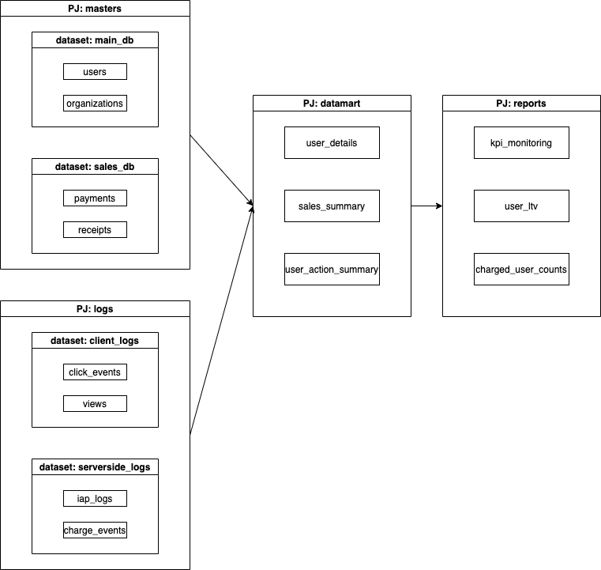
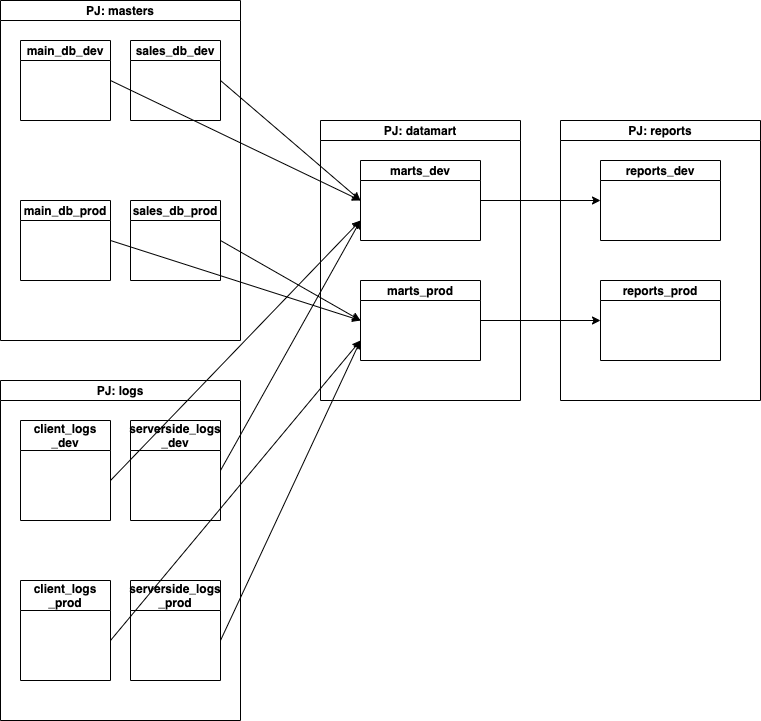
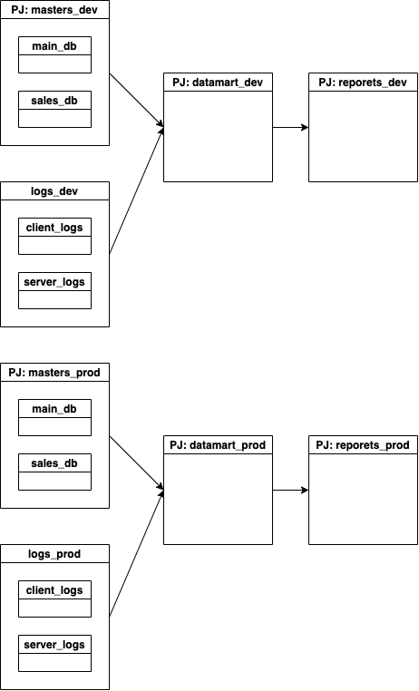

三行で:

1. BigQueryにデータマートを構築するにあたりPJ、datasetの設計をよく考えないとあとで手戻りが発生するので気をつけよう。
2. まずは環境ごとにPJ分離を検討しよう
3. PJ分離の手間は必要な手間

<!--more-->

## 詳しく


現状の構成はこう:



* masters: DBからデータを取り込んだもの一式が入っているPJ。すべてのtableは最新のpartitionに最新のデータが一式入っているので常に最新のpartitionを参照すれば最新のデータが全部取れる。

* logs: client logやserver logなどデータ量の多いものが一式入っているPJ。差分のみを確認したいデータのみが入っている（逆に全件参照したい場合は全partitionを参照する必要がある)。

* datamarts: 中間データが一式。

* reports: 最終アウトプット。BIなどから参照する。

[データ基盤の3分類](https://yuzutas0.hatenablog.com/entry/2018/12/02/180000)に当てはめれば、master, logsは"Source", datamartsは"Warehouse", reportsは"Mart"に該当し、これらをPJ分離させる方針にしている。

sourceという同一の概念であるデータが複数PJに分かれている点は若干気持ち悪い気もするが、データの特性上partitionに対するデータの持ち方が異なり、それがPJの分離によって表現されていると考えればまぁよいかな、くらいに考えていた。

が、この構成を複数環境、具体的には開発環境と本番環境のような形で持つことを考えると途端に都合が悪くなる。

現構成のまま複数環境を持つときはこうなる:




つまり全てのdatasetに環境ごとのsuffixを持たせるなどでしか表現できず、内部の実装はおろか、全てのSQL上の参照テーブルに環境suffixを埋め込む必要が出てきてしまうのだった。例えばこんな具合に。

```sql
SELECT
  user_id,
  SUM(price),
  left_at
FROM (
  SELECT
    users.id AS user_id,
    sales.price,
    users.left_at
  FROM
    masters.main_db{{ params.ENV_SUFFIX }}.users
  INNER JOIN
    masters.sales_db{{ params.ENV_SUFFIX }}.sales
  ON
    users.id = sales.user_id
  WHERE
    users.left_at IS NOT NULL ) user_sales
GROUP BY
  users.id
```

数ファイルならまだしも、マート数、処理数が50, 100と増えてくると書き換えも苦労する。


一方、PJさえ分けてしまえば実行時に対象のPJを指定する実装こそ必要なものの内部の実装は一切いじる必要がなくなりcopyで済む。



もちろん、PJが増加するに伴い権限管理を始めいくつかの手間が増すが、セキュリティ観点からも環境でデータが分離できていることはメリットになるだろうし、必要な手間だと考える。


