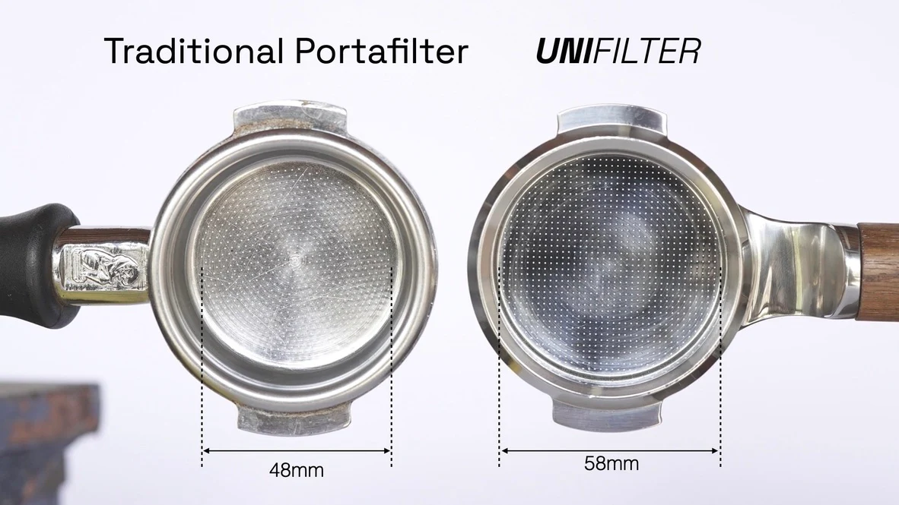

+++
title = "エスプレッソマシン事始め"
date = 2024-01-02T18:19:13+09:00
Author = "reizist"
keywords = ["エスプレッソマシン", "espresso machine", "エスプレッソ", "espresso", "コーヒー", "coffee", "Flair", "Breville", "De'Longhi", "Solis"]
Cover = "https://blog.reizist.com/post/espresso-machine/cover.jpg"
summary = "エスプレッソマシンについて初心者が調べまとめました。"
tags = ["life", "gadget"]
toc = true
draft = false
+++

お家生活を豊かにする活動を継続的に行っている。
<!--more-->

胃弱により諦めていたコーヒーがサプリメントの類の効能により飲んでもお腹が痛くならないようになったため、まずはドリップコーヒーを一年ほど楽しんでいた。

がエスプレッソに興味が湧き調べ始めたところ、かなり奥が深い世界であることがわかってきたので調査した内容をメモしておく。

## エスプレッソとは

エスプレッソはドリップコーヒーとは異なり高い圧力で蒸気を通して急速に抽出することで濃厚かつクリーミーになるのが特徴で、
少量・濃厚である特徴を活かして他の液体との組み合わせれば多くの楽しみ方が存在する。
例えばミルクを蒸気で温めて作ったフォームミルクやスチームミルクを組み合わせればカフェラテやカプチーノになるし、
ウィスキーやウォッカなどのアルコールと組み合わせればアイリッシュコーヒーやエスプレッソマティー二というカクテルになるし、
アイスに加えればアフォガードというデザートにもなる。

## どうやって作るか
まずは以下の動画を観ると後述するエスプレッソの抽出フローについて理解がスムーズになる。



エスプレッソを抽出する工程としては

1. グラインド
  - コーヒー豆を粉砕・粉状にする工程。エスプレッソにおいてはドリップコーヒーに比べ細かな状態にする必要がある
	- 粉状になったコーヒー豆をポルタフィルタに入れる。
2. ディストリビューション
  - 後の工程でコーヒー豆に対し均一に圧力をかけるためにポルタフィルタ上のコーヒー豆がだまにならないようニードルを使って均す工程。WDT(Weiss Distribution Technique)とも言われる。
3. タンピング
  - コーヒーグラウンドをポルタフィルタ内で均等に圧縮する工程。
4. 抽出
  - ポルタフィルタをエスプレッソマシンにセットし、(58mmのポルタフィルタで一般的に)9気圧程度の圧力をかけて25-30秒かけて30mlほどの量を抽出する。

のようになる。

正しく抽出されたエスプレッソは、乳化しクレマと呼ばれるクリーミーで濃い泡状の層が形成される。むしろクレマをいかに綺麗に作るかが重要と言っていい。

単純化した上記の工程内にさえ

* コーヒー豆の種類・鮮度・挽き方
* ポルタフィルタのサイズ
* 抽出の際の抽出温度・蒸し時間・圧力のかけ方

などの変数があり、更に細かく言えば
ポルタフィルタ内で使用するフィルタの可否(紙またはアルミ製)によるクレマへの影響、ポルタフィルタの形状(従来バスケットの製造工程の制約から58mmのポルタフィルタでも下部の抽出先と抽出元とで面積が異なり抽出工程で一様の圧力がかからない)など考え出すときりがないほど差分が出てくる。

これらをどこまで考慮するかによって選択するべきマシンやその価格が大きく変動するので、影響が大きそうなところ=コーヒー豆の挽き方、ポルタフィルタの選択、圧力の調整あたりに重きをおくと良い。

## エスプレッソマシンの選び方
エスプレッソマシンを選ぶにあたり、まず大きな分岐点としては
* マニュアル
* セミオート
* オート

の3段階に分かれ、更にグラインド機能の有無やスチーム機能の有無などが大きな変数となるだろう。

### マニュアル

手動の良いところとしては、圧力加減を自分で調整できる点と、基本的に電力を必要としない点にある。
また複雑な機構が存在しないのでメンテナビリティも高いことは十分メリットになるだろう。
手動のマシンとして昨今最も有名になったのがFlair社のものだ。



Flair社のプロダクトラインでも4段階あり、
* 58x: 業務用互換(プロ仕様)のポルタフィルタ58mmに対応
* PRO2: ダブル(=2倍量)に対応/ポルタフィルタは44mm
* Signature: シングル量のみ/ポルタフィルタが廉価版
* NEO: タンパーなど付属しない最安価エントリーモデル

2.5万〜7.5万の幅で自分にあったものがチョイスできる。（細かくは更に予熱周りを電化式にしたモデルも存在する）。

ちなみにイタリア製のハイエンド機としてはLA PAVONI社のPL LUSSOがある(2024/1現在19万円)。



### セミオート

セミオートの特徴として、
エスプレッソの作成工程の
* グラインド
* ディストリビューション
* タンピング

や、その後のカフェラテ/カプチーノのためのスチームミルクの作成については手動で行う必要があるタイプである。
完全自動とは違いそこそこ時間がかかるが、最も手軽にコーヒーを淹れる楽しみを享受できるものだと思う。

イタリア製のDe'Longhi(デロンギ)やgaggia(ガジア)、スイス製のSolis(ソリス)、オーストラリア製のBreville(ブレビル)などが有名で、こちらも家庭用に絞っても3万〜30万とかなり幅がある。

選び方としては代表的な変数でいうと

* 水温管理の方法
  - 水温管理機構の種類: サーモブロックかボイラーか。サーモブロックは素早く加熱できるので電源オンからの待機時間が短く済む反面、細かな温度制御ができない。一方ボイラは加熱に時間がかかるが高度な温度管理ができる。
	- ボイラーの数: 通常1つのボイラーがあり、抽出とスチームを切り替える際に時間がかかる。ダブル/マルチボイラーになると切り替えが必要なくなりスチームと抽出が同時に行える。
	- PIDの有無。抽出温度の管理ができる。
* スチームの強さ/精度
  - フォームミルクを作る際いかに迅速に60℃程度に挙げられるか。時間がかかるほど水分量が増え仕上がりが水っぽくなったり撹拌力が低いときめ細やかな泡が生まれない。
* グラインド機能の有無/ブレードタイプ
  - 豆を挽く機能もついているので別途グラインダーを用意する必要がない。
	- タンパー機能が付属するものも。
	- ブレードの種類としてフラット刃/コニカル刃がありコニカル刃はフラット刃に比べて静音・豆への摩擦熱の影響が軽微。
	
* 圧力の強さ/圧力計/圧力調整機構の有無
  - 手動で抽出する際再現度を上げるための目安として圧力のかけ方を一定にする必要があり、圧力や圧力調整機構がついていると解決できる。
* ポルタフィルタの対応サイズ
  - 一般に最も売れているラインナップでは44mmや51mmなど独自のサイズ規格にしていることが多く、個別に最適化すると汎用性が下がるので理想的には58mm/VSTが使えると良い。
* 静音性

などがあり、それに加え
* 価格
* デザイン

を鑑みて総合的に判断する。ざっくりコストで並べると以下の通り。

#### エントリー
* デディカ 2024/1時点: 34000円前後


* グラングストー 2024/1時点: 40000円前後
  - エントリーモデルとしては珍しくポルタフィルタが58mm。スチームが弱いと噂。


* gaggia classic 2024/1時点: 62000円前後
  - 内部設計がシンプルな分回路図などがインターネットに出回っておりハックして３0万ランクのマシン相当の機能をつけるカスタマイズをするなどが流行っている。


#### 中級
* Solis パーフェクタプラス 2024/1時点: 74000円前後
  - グラングストーの上位機としてスチーム力に特に改善が見られるがポルタフィルタが謎の54mm設計。タンパーやミルクジャグ、ポルタフィルタなどエスプレッソ・ラテアートを始めるのに必要なものが一通り揃っている点好印象。
	


* Breville バンビーノプラス 2024/1時点: 98000円
  - そろそろ準業務用の価格帯に入ってくるもポルタフィルタは54mm。



* De'Longhi ラ・スペシャリスタ・プレスティージオ 2024/1時点: 152000前後
  - グラインダー付き・タンピング機能付きのオールインワン。



* Breville (ブレビル) BES870BSXL ザ バリスタ エクスプレス
  - グラインダー付き・



#### 上級

TBC...

### オート
ボタンを押すだけでエスプレッソ/カプチーノ/カフェラテなどが出来上がる全自動機。
毎日手軽に一定の美味しさのコーヒーを飲める。

* De'Longhi(デロンギ) マグニフィカS 2024/1時点: 66000円前後



TBC...

## 所感
家庭用でグラインダーを一旦考慮しないことにして抽出機のみで検討すると、
最低6万〜が購入ラインになりそうだがそれでも許容できない不満がいくつかあり、
例えばポルタフィルタはなるべく58mmにしたいと思っている。
業務用規格/ハイエンド機が58mmで統一されているから質の高いバスケット、具体的には[Weber WorkshopsのUnifilter](https://weberworkshops.com/products/unifilter)などを将来使いたいことを考えると51mm/54mmで謎の妥協をしないほうがいいだろうとは考えている。

ただし抽出機に20万出せるかというとそこまでのモチベーションは無いというか、それだったら5万のグラインダーと10万の抽出機にしたかったりする。

妥協点としては流石にマルチボイラーは諦める。
とするとグラングストーにしてスチームに目をつむるか、Flair 58x+フォームミルク生成機を別途運用するか。流石にスチームと抽出は一体であってほしい、、うーん、と堂々巡っている。

[redditでも同じように一ヶ月悩んでバンビーノプラスに決定したユーザーがおり](https://www.reddit.com/r/espresso/comments/18weul4/after_months_of_research_and_youtube_videos/)大変親近感が湧いている。(グラインダーは [Turin DF64 Gen2](https://www.turingrinders.com/)。)

高い買い物にはなりそうなのでもうしばらく悩むことを楽しみたい。

