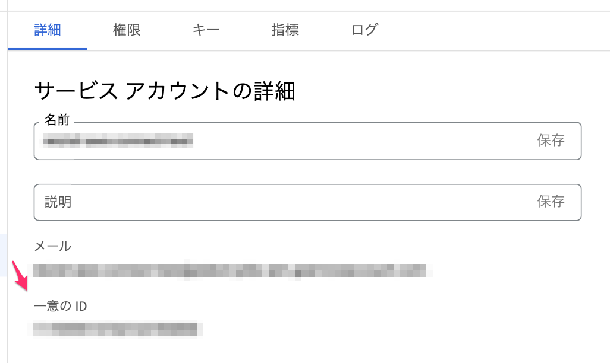
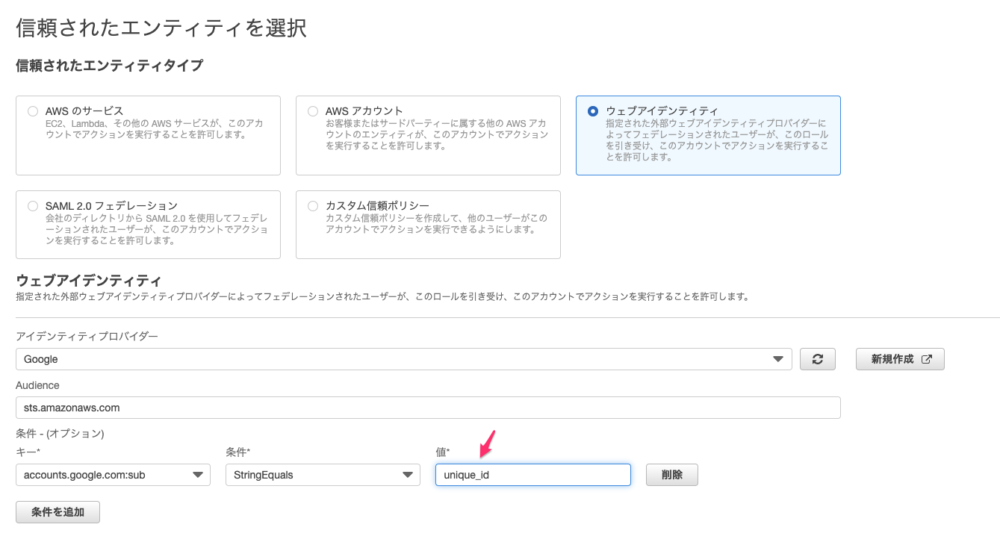

AWS Security Token Service(STS)を使って、GCPのservice accountから一時的なAWS認証情報を生成し
実質service accountがAWS IAMのように振る舞うような状態にする。

実装そのものは[ここ](https://gist.github.com/reizist/e7dfc77dc5b0267b4083044356fb77cc)においてある。

<!--more-->

以下詳細。

## 事前準備

* GCP側で使用するservice accountのunique idをメモる



* AWS側でIAM roleを作成する




作られるエンティティはこう

```json
{
    "Version": "2012-10-17",
    "Statement": [
        {
            "Effect": "Allow",
            "Action": "sts:AssumeRoleWithWebIdentity",
            "Principal": {
                "Federated": "accounts.google.com"
            },
            "Condition": {
                "StringEquals": {
                    "accounts.google.com:sub": [
                        "unique_id"
                    ],
                    "accounts.google.com:aud": [
                        "sts.amazonaws.com"
                    ]
                }
            }
        }
    ]
}
```

ただしこのままだと動かず、Conditionを手動で編集して
`accounts.google.com:aud` の部分を削除したら動いた。


```json
{
    "Version": "2012-10-17",
    "Statement": [
        {
            "Effect": "Allow",
            "Action": "sts:AssumeRoleWithWebIdentity",
            "Principal": {
                "Federated": "accounts.google.com"
            },
            "Condition": {
                "StringEquals": {
                    "accounts.google.com:sub": [
                        "unique_id"
                    ]
                }
            }
        }
    ]
}
```

実際にGCP上で取得できるpayloadとしては

```
{'aud': 'sts.amazonaws.com', 'azp': 'your_sa_name@PJ.iam.gserviceaccount.com', 'email': 'your_sa_name@PJ.iam.gserviceaccount.com', 'email_verified': True, 'exp': xxx, 'iat': xxx, 'iss': 'https://accounts.google.com', 'sub': 'unique_id'}
```

という形式になっていて、
`aud` にはパラメータで指定したaudienceが、 `sub` には使用するservice accountのunique idが格納されているが、
policy上 `aud` と `sub` 両方でStringMatchしたほうが硬いとは思っている。

Audienceというパラメータは
[AWS Doc](https://cloud.google.com/compute/docs/instances/verifying-instance-identity?hl=ja#curl)によれば

> AUDIENCE: インスタンスとインスタンスの ID を確認するシステムとの両方によって合意された一意の URI。たとえば、2 つのシステムの接続に使われる URL などです。

とあるので `sts.amazonaws.com` を採用してみたのだけど、

[また別のAWS Doc](https://docs.aws.amazon.com/IAM/latest/UserGuide/reference_policies_iam-condition-keys.html)に言わせれば　

> aud for OAuth 2.0 Google client IDs of your application, when the azp field is not set. When the azp field is set, the aud field matches the accounts.google.com:oaud condition key.

と書いてあったりしてよくわかっていない。

[GCP Doc](https://developers.google.com/identity/protocols/oauth2/openid-connect)には

> 	この ID トークンの対象オーディエンス。アプリケーションの OAuth 2.0 クライアント ID のいずれかにする必要があります。

とあるので、少なくとも特定のSAのtokenであることを検証するのは `sub` を使うのがいいんじゃないかとは思う。
現時点では `aud` の扱いはわかっていないので詳しい方は https://twitter.com/reizist まで教えてくれると助かりますm(__)m

あとは必要に応じて更にpolicyをattachする。(今回はS3 Full Accessをつけて検証している)

## 実行
準備は上記だけでよくて、あとはscriptを実行すると動く。

```
❯ ASSUME_ROLE_ARN=arn:aws:iam::xxxx:role/your_role S3_BUCKET=your_s3_bucket python s3_ls.py
s3.ObjectSummary(bucket_name='your_s3_bucket', key='xxx')
```

## 補足
https://gist.github.com/reizist/e7dfc77dc5b0267b4083044356fb77cc
の補足としては、

`get_id_token()` と `get_id_token_via_metadata()` が両方実装してあって、
前者はservice accountからWebIdentity tokenを取得するメソッド、
後者はGCP上の環境から取得するメソッドになっているが現時点ではローカル環境から動かしているため `get_id_token()` を採用している。
実際にはCloudRun上でaws commandを叩きたいためにこの調査をしているので、CloudRunに設定したservice accountを使いたいため `get_id_token_via_metadata()` を使うことになりそう。（※ compute engineでしか試したことないけど、 [CloudRunでもメタデータサーバー参照できそう](https://cloud.google.com/run/docs/securing/service-identity?hl=ja#identity-tokens) )


あとは、CloudRunのendpointにrequestを飛ばすたびにtokenを取得しなおすかどうかはもう少し考えたい(毎request token生成は余計な処理な気はするのでどこかにキャッシュさせたく、ディレクトリ書き込みしてみたりSecretManagerに書き込んでみたりしてみたい)。


## 参考
* [boto3 doc](https://boto3.amazonaws.com/v1/documentation/api/latest/reference/services/sts.html#STS.Client.assume_role_with_web_identity)
* [インスタンスIDの確認](https://cloud.google.com/compute/docs/instances/verifying-instance-identity?hl=ja#curl)
* [google-auth doc](https://google-auth.readthedocs.io/en/master/_modules/google/oauth2/service_account.html#Credentials)


