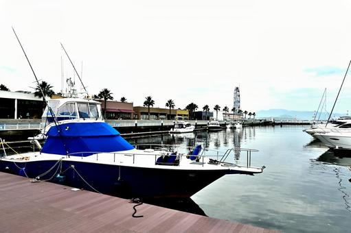

## はじめに

リクルートという会社は、[在籍3年ごとに最大28日連続で取得できるSTEP休暇なる制度がある](https://recruit-saiyo.jp/benefits/)。

コロナ以前の時代では、多くの社員が海外に飛び立つ為に取得していたように見受けられたが、コロナ禍において海外に飛び立つのは流石に憚られた。

仕事以外の、人生スケールでの今後の生き方を考え、最終的には海の近くでゆったり暮らしたいという願望や[リクルートで流行っている（※N=2)](https://tondol.hatenablog.jp/entry/boat-license-in-numazu)ことを踏まえ、船舶免許を取得することにした。

<!--more-->

## 船舶免許について

船舶免許には 「1級小型船舶免許」「2級小型船舶免許」「湖川小出力限定免許」「特殊小型船舶免許」 の4種類が存在する。
1級船舶は2級/湖川小出力限定の上位互換と考えて差し支えない。
特殊小型船舶は水上バイクを運転したい場合に必要だ。
また2級船舶は海岸から5海里(約9km)の範囲に限定された免許であるが、日本においては、[小笠原諸島や佐渡島などのごく一部の島を除き](https://jci.go.jp/areamap/heisuiengan.html)本島沿岸からアクセスできるため魚釣りなどの一般用途では困るケースは少ないだろう。
沖縄の諸島近辺を横断するなどの場合、1級船舶が必要になる。
2級船舶と1級船舶の受講料の差はおおよそ2-3万程度、取得にかかる日数の差としては1-2日程度のためこの差分が気にならなければ1級船舶をとってしまってもいいのではと思う。
また特殊船舶も同時受講すると一部の学科が免除されるという点でも効率は上がる。

なお、船舶免許は5年更新で、1万円程度の実費がかかるためそれも踏まえて取得を検討するとよい。

## 自分のケース
小型船舶免許の取得はどこでも可能だが、自分の場合受講のためのアクセスのしやすさなどから東京近郊での取得に決め、[サウスランド](https://www.southclub.net/)にて受講し実稼働5日で1級船舶/特殊船舶を取得した。計146,000円程度かかった。

東京湾マリーナを拠点とし、夢の島マリーナ、新砂水門を経由し荒川に出るルート

<iframe src="https://www.google.com/maps/embed?pb=!1m18!1m12!1m3!1d8000.75881122529!2d139.8279018113802!3d35.653159363845575!2m3!1f0!2f0!3f0!3m2!1i1024!2i768!4f13.1!3m3!1m2!1s0x60188843e573d2a1%3A0x2be7f036968badee!2z5p2x5Lqs5rm-44Oe44Oq44O844OK!5e0!3m2!1sja!2sjp!4v1632196594845!5m2!1sja!2sjp" width="600" height="450" style="border:0;" allowfullscreen="" loading="lazy"></iframe>

で実技を行う。
タイミングが良く風も波も比較的静かで、ほとんど滞りなく進行した。（実は実技において人命救助など配点が高そうな部分で操船ミスをし実技には一度落ちた。その後即日再試験をし合格した。)

東京湾マリーナの最寄り駅は東西線の南砂町駅だが、学科は葛西駅徒歩3分の場所で行う。(特殊免許もあわせて)5日間ほど葛西に朝9時30分から学科が組まれているため、葛西近辺に滞在したほうが便利だと考え[SG Premium KASAI](https://www.booking.com/hotel/jp/sg-premium-kasai-vacation-stay-44353v.ja.html)に宿泊した。

立地がよく、駅から4分、コンビニ・スーパー・飲食店が徒歩5分圏内で完結し、また近くの区民館にはレンタサイクルがあるので自転車10分の距離のショッピングモールへも足が伸びた。

## 船舶免許の用途

船舶免許を取得後、どのように活用すればよいのかをざっくりと書いておく。

まずは購入が思いつくが、ざっと[ヤマハのボートラインナップ](https://www.yamaha-motor.co.jp/marine/lineup/boat/)を眺めるだけでも驚くと思う。自分は驚いた。イメージするかっこよさげなボートが1500万〜で、最低限釣りを目的とした安価なボートを購入するにしても300万〜から。
また船を止めておく(=係留)、車でいう駐車場代が[年間40万〜](https://yumenoshima-marina.subaru-kougyou.jp/berth/fee.html)で、
更にエンジンオイル/塗装などのメンテ費、保険、オイル/アノードなどの消費物費用で年間10万程度は最低かかると考えると、小市民が気軽に購入できるものではないなというのが正直な感想だった。
(東京だから余計係留費が高いなどの事情はあるかもしれない.地方の移住モチベーションが強くなるのであった。)

となるとレンタルが直近の唯一の選択肢になり、
例えば[ヤマハの会員サービスシースタイル](https://sea-style.yamaha-motor.co.jp/system/)では、入会金：22,000円（税込）/初年度のみ。月会費：3,300円（税込）/月で会員になった後に 5000円/3h 程度の価格でレンタルすることができる。
[ちょっとかっちょいい機種](https://sea-style-m.yamaha-motor.co.jp/Lineup/Info/detail/boatmodelcd/173)になると25000円/3h程度に跳ねるが、4-5人で乗ると考えると5000円程度の実費ならカジュアルにレンタルできるかもしれない。

いずれにせよ思ったよりはコストがかさむ趣味であることには違いない。

## まとめ

1週間、ワーケーションの感覚で葛西に滞在し、1級船舶/特殊船舶を習得した。
葛西での取得はアクセス、快適さからおすすめできる。
船舶免許取得後は、レンタルでクルージング等を楽しむことができるが、それなりにコストはかかる。